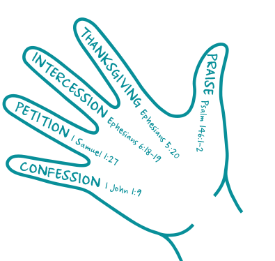

# THE PRAYER HAND

```
Many believers find extended time in
prayer is a difficult spiritual discipline.
Here’s an easy way to remember five
essential aspects of prayer. Pray through
each of these five aspects, remembering
that prayer is really about aligning our
hearts with God’s, and as the fifth aspect
explains below, praises to God should
permeate every part.
```
## 1

## CONFESSION

**I agree with God
about my sin.**
“If we confess our
sins, he is faithful
and just and will
forgive us our sins
and purify us f rom all
unrighteousness.”
**_1 John 1:_**

## 2

## PETITION

```
I ask God to provide
for my needs.
“I prayed for this child,
and the Lord has
granted me what I
asked of him.”
1 Samuel 1:
```
## 3

## INTERCESSION

```
I ask God to provide
for the needs of
others.
“And pray in the Spirit
on all occasions with
all kinds of prayers
and requests. With
this in mind, be
alert and always
keep on praying
for all the Lord’s
people. Pray also for
me, that whenever
I speak, words may
be given me so that
I will fearlessly make
known the mystery
of the gospel...”
Ephesians 6:18-
```
## 4

## THANKSGIVING

```
I thank God for what
He has done in,
through, and for me.
I thank Him for His
answers to prayers
in the lives of those
around me and for
His ongoing work
across the nation
and the world.
“...always giving
thanks to God the
Father for everything,
in the name of our
Lord Jesus Christ.”
Ephesians 5:
```
## 5

## PRAISE

```
I let my enjoyment
and adoration of
God overflow into
words. As the thumb
is able to touch all
four other fingers,
so praise should
permeate
every part of my
prayer life.
“Praise the Lord.
Praise the Lord, my
soul. I will praise the
Lord all my life; I will
sing praise to my
God as long as I live.”
Psalm 146:1-
```
```
THIS TOOL IS MEANT TO BE SHARED. To download a copy visit navlink.org/prayer-hand
The Prayer Hand © 1964 (2016) by The Navigators. All rights reserved.
```
## Navigators

## Discipleship

## Tool


